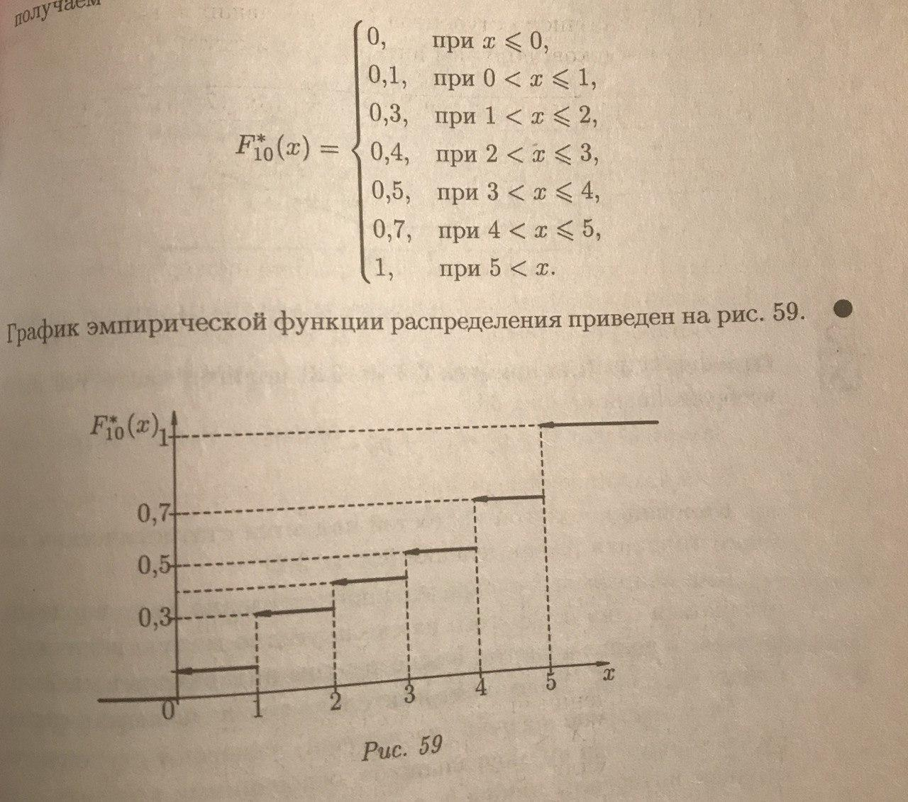

# Ститистическое распределение выборки. Эмпирическая функция распределения

**Ранжирование** ([1 стр 181]) - операция расположения значений случайной величины (признака) по неубыванию. Полученная таким образом последовательность значений случайной величины называется **вариационным рядом**.

**Частоты** ([1 стр 182]) - числа, показывающие, сколько раз встречаются варианты, в ряде наблюдений, а отношение их к объему выборки называется **частостями** или **относительными частотами** (p^{\ast})

**Статистическим распределением выборки** или **статистическим рядом** называется перечень вариантов и соответствующих им частот или частостей.

*example_1* - пример статистического ряда и вариационного ряда

*Статистическое распределение выборки является оценкой неизвестного распределения*

В случае, когда число значений признака (случайная величина *X*) велико или признак является неприрывным (т.е. когда случайная величина *X* может принять любое значение в некотором интервале), составляют **интервальный статистический ряд**

для определения величины интервала (*h*) можно использовать **формулу Стерджеса**:

h=\dfrac{x_{\max}-x_{\min}{1+\log_{2}n} 

m=1+\log_{2}n - число интерваллов

За начало первого интервала рекомендуется брать величину x_{\нач}=x_{\min}-\dfrac{h}{2}

*n* - количество наблюдений

*example_2* - пример интервальный статистический ряд

Одним из способов обработки вариационного ряда является построение **эмперической (статистической) функции распределения** - функция, определяющая для каждого значения *x* частость события {*X* < *x*}:

F^{\ast}_{n}\left(x\right)=p^{\ast}\left\{X<x\right\}=\dfrac{n_{\x}}{n}

где *n* - объем выборки, *n_x* - число наблюдений, меньших *x*.

Эмперическая функция распределения F^{\ast}_{n}\left(x\right) является *оценкой* вероятности события {*X* < *x*}

## Теорема (Гливенко):

Пусть *F*(*x*) - теоретическая функция распределения случайной величины *X*, а F^{\ast}_{n}\left(x\right) - эмперическая. Тогда для любого \varepsilon > 0

\lim_{n\rightarrow\infty}\left\{\left|F^{\ast}_{n}\left(x\right)-F\left(x\right)\right|>\varepsilon\right\}=0

используя условие из *example_1*

получаем:

