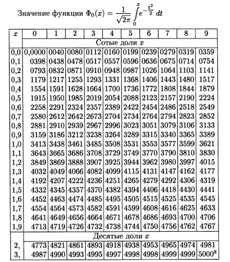
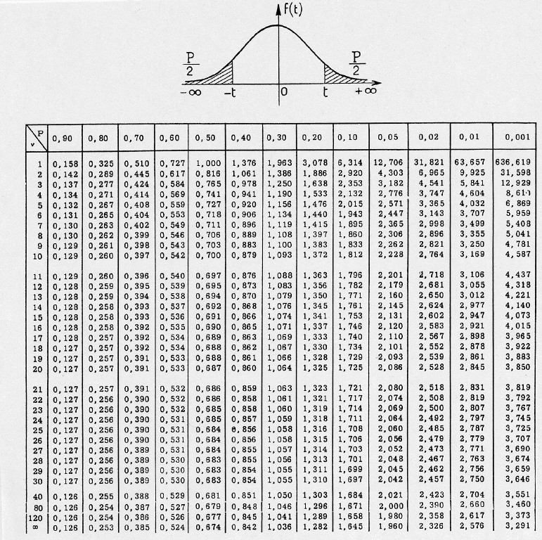
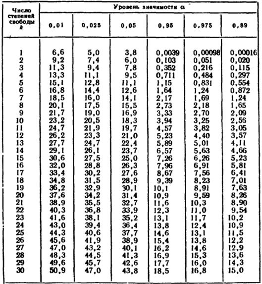

# Доверительные интервалы для параметров нормального распределения

Интервал %0A), накрывающий с вероятностью  истинное значение параметра , называется **доверительным интервалом**, а вероятность  **надежностью оценки или доверительной вероятностью**.

Построим доверительные интервалы для параметров нормального распределения, т.е. когда выборка производится из генеральной совокупности, имеющей нормальное распределение с параметрами  и .

1. **Доверительный интервал для математического ожидания при извстной дисперсии (использование таблицы функции Лапласа)**

*example_1* - пример

2. **Доверительный интервал для математического ожидания при неизвестной дисперсии (использование таблицы квантилей распределения Стьюдента)**

*example_2* - пример

3. **Доверительный интервал для среднего квадратического отклонения нормального распределения (использование таблицы квантилей  распределения )**

*example_3* - пример

